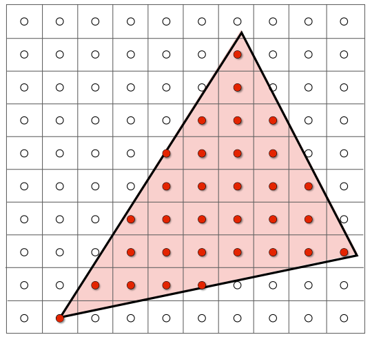
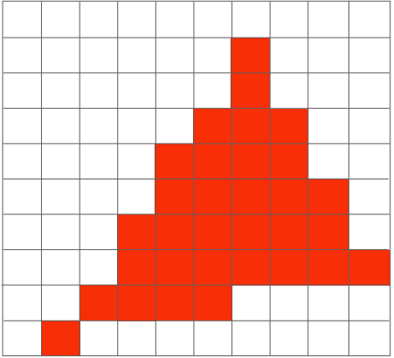

# Lecture 04 Transformation con

补充内容

旋转操作默认是逆时针旋转，旋转-a角度的矩阵等号旋转a角度的转置，在定义上旋转-a和旋转a正好互相逆。所以旋转矩阵是``正交矩阵``

## View/Camera transformation

什么是视图变换？简单而言确定相机的位置和摆放

- 如何进行识图变换？

- Define the camera first

    >Position \hat e
    >Look at / gaze direction \hat g
    >Up direction \hat t

我们可以把相机固定不动放在原点（约定俗成的位置），朝-z方向看，向上方向是y

如何将任意位置的相机放到上述位置？

1.平移 \hat e 到原点：做平移变换

2.旋转gaze direction 到-z ，旋转Up direction 到 Y轴
（可以使用旋转的逆变换）

## Projection transformation

图形学中的投影：3D to 2D

透视投影是在一个点投射成四棱锥形成；正交显示若将相机放于无限远，远、近平面将无限接近。

### Orthographic projection

一个简单的理解方式：相机固定在原点，朝-z方向看去，向上指向y，drop z坐标，然后平移缩放到[-1,1]的平面中

### Perspective projection

满足近大远小，从一个点往一个方向上去看，得到一个四棱锥

简单地说就是将Frustum的远平面挤压成跟近平面一样大的平面而z不变，在进行正交投影

# Lecture 5 Rasterization1(Triangles)

## What's after MVP

Model transformation(placing objects)
View transformation(placing camera)
Projection transformation
-正交投影（搞到一个[-1，1]的立方体中）
-透视投影（先转换到正交投影，再做正交投影）

## Canonical Cube to Screen

屏幕：一个二维数组,数组中的每一个元素为每一个像素。

光栅(Raster) ：德语中的屏幕的意思

Rasterize ：Drawing onto the screen

将一个立方体“放到”屏幕上时，z坐标方向暂且不管，将x,y坐标方向由[-1,1]拉伸到[]0,width]和[0,height] (由一个变换矩阵变换)

## 光栅化（三角形）

判断三角形与像素的位置关系，更确切来说，判断像素中心点与三角形的位置关系

A Simple Apporach:Sampling

通过判断屏幕上所有的的像素的坐标中心是否在三角形内部，来决定像素的color。

如何判断一个点是否在三角形内部？

利用向量叉积！对于三角形ABC和P点，判断向量AB、BC、CA和AP,BP,CP的叉积是否为同号，若为同号，则P点在三角形内部。对于在边界上的点，可以自行定义。（对于openGL和directX，落在上边和左边的点算在三角形内部：即涂上不涂下，涂左不涂右，可以保证不会漏掉也不会多涂）

单纯这样的光栅化会造成一个图形的走样：锯齿，为了解决这个问题会提出抗锯齿或反走样的方法。

